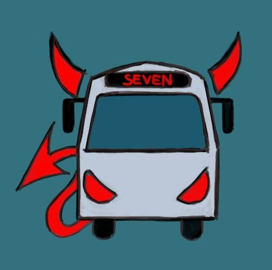

# Team7: The Seven Deadly Sins

 

# All Members:
Name | Role
---- | ---
Etsu Nakahara   | Lead/Comms  |
Li-An Yang      | Co-lead/Comms  |
Chunan Huang   | Quality Assurance |
Christian Schroeder    | Quality Assurance |
Eric Shaoan Liu | DevOps |
Dan Nguyen      | DevOps |
Cortez Page         |  Tool&Utility |
Ethan Brand         |  Tool&Utility |
Yiming Wang       | Coders  |
Ryan Murase      | Coders  |
